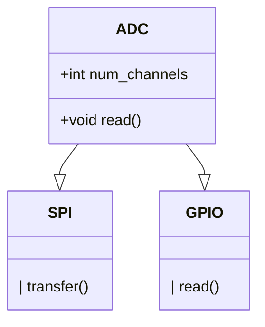
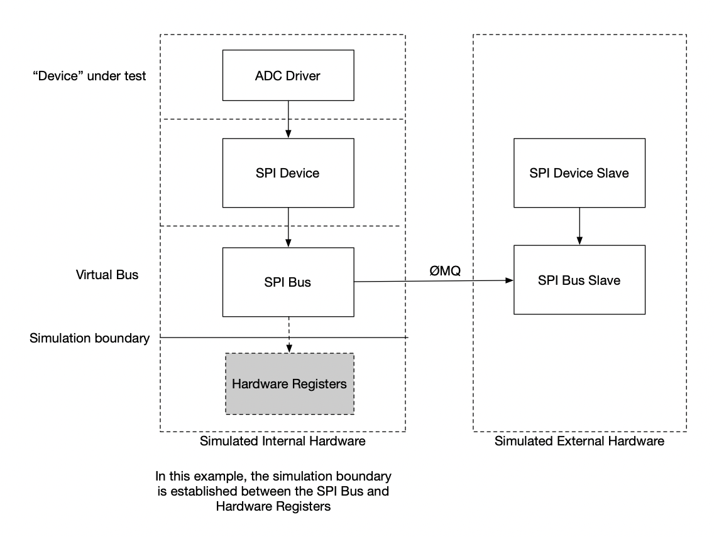
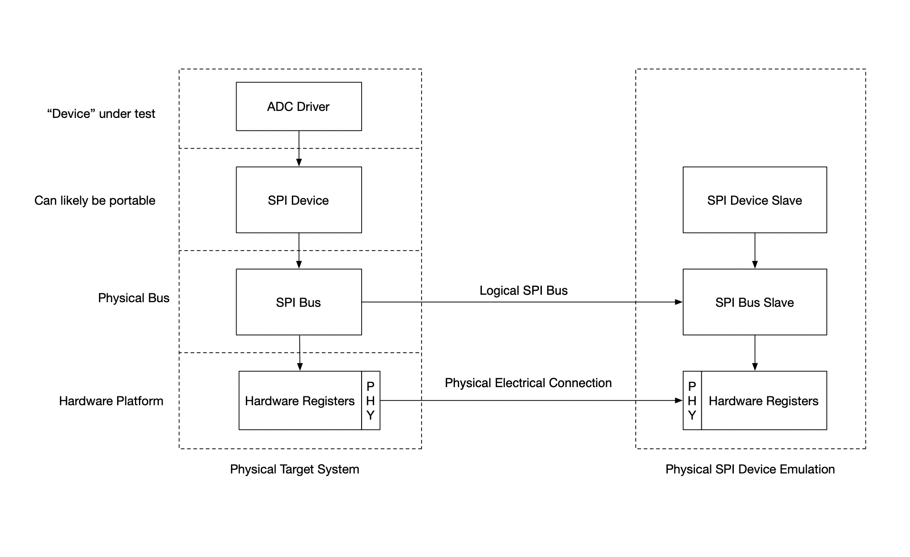

# Design Goals and Philosophy

## Background
I have been developing software for embedded systems for about ten years. This experience has given me a unique perspective. 
Unique here should not be interpreted as "superior" or "wise", simply unique in that I am one conscious being with my own history and experiences and this shapes how my mind interprets the world, and how I design software. I will do my best to extract the reasons behind decisions, and make as much intent clear as possible. Expanding on the reason behind every decision would likely take volumes, and would never be complete unless you the reader could be given my exact life experience, so liberties will be taken to focus on what I deem the most salient inputs to a decision. Should you be confused or curious, don't hesitate to ask and I will attempt to explain.

### Experience
 - Safety critical system for material handling robot
 - Self test software for high volume consumer electronics manufacturing
 - Motor control algorithms and communication
 - Mission and safety critical flight software for aerospace
 - Fun personal projects in audio, lighting, wireless communication and more

## "Tenants" of design philosophy

I've come away from these experiences with a number of "tenants" of design philosophy.

 - Make code as simple as possible, not simpler. Make complexity explicit 
 - Think about as many future possibilities for the code, then pick the simplest possible design that doesn't close any doors
 - Make as much code as possible portable
 - Make dependencies explicit
 - Only use 3rd party code for very well-defined functions, and have a plan for removing it if necessary
 - Make system state explicit, visible and easy to introspect
 - Consider the entire lifecycle and all stakeholders and people that will interact with the code/system

If I had to summarize my design philosophy into one sentence it would be something like "Think deeply, trust your intuition, and be honest and explicit."

## Language and Tools

I know C very well. 
I know C++ decently well. 
Auto-generating source files that are primarily configuration is great. One source of truth is nice when it doesn't become dogma.
Rust is cool. It seems to have a larger barrier to entry. I'd love to use it, but it doesn't "feel" right. 
I'm watching Zig, vlang, Ada.
Python is great for building things quickly, but a bit challenging to build large systems with, though type hints and IDEs make this easier
Vim keybindings are nice. IDE like features are great. I choose both with CLion. I wish I used Emacs but it's never stuck. VS Code seems lovely. I haven't used it much.

Having a well-defined standardized build system makes tool choices less important. CMake appears to be the least terrible build system. Maybe Bazel is better, I don't know yet, and it's less supported.

## Implications in Firmware Realm

### Fast Iteration
 - Compile often for different platforms. The developer should be able to compile and run most code quickly
 - Test stubs for unit tests should exist for most or all core drivers and libraries
 - It should be possible to run most application layer "firmware" on Linux/Windows/Mac OS. 

## Aspirations
This section consists of ideas I think are a good idea, but haven't actually tried

### Test Abstractions
 - Multiple ways to draw an abstraction boundary around a device under test
 - For example, we could test a high level driver for an external ADC by giving it a SPI driver handle, which in turn talks to a simulated external ADC implementing a SPI slave device. The simulated ADC could instead implement a register model API, ignoring the SPI layer entirely.

 - In theory, the register level simulation could be programmed onto a physical chip implementing an SPI slave device, and then be inserted into a physical system to simulate/emulate the ADC at the SPI level, with simulated anlog inputs.

   1. Python test harness, loads firmware onto MCU development board
   2. Firmware establishes communication with python test harness
   3. Python test harness commands simulated ADC into known state (set inptu channels to certain values)
   4. Python test harness instructs firmware to read ADC values (unclear what level of abstraction)
   5. Python test harness compares firmware reported values to expected values
 
       MCU Development Board -> Real SPI bus -> SPI Slave device emulator -> SIM backend bus -> Python
 
    This whole exercise could also be done entirely in software
   1. Python test harness loads linux executable into memory and connects to simulated ADC via RPC of some kind
   2. Firmware establishes communication with python test harness over simulated UART or other communication bus
   3. Python test harness commands simulated ADC into known state (set input channels to certain values)
   4. Python test harness instructs firmware to read ADC values (unclear what level of abstraction)
      Firmware is written against the SPI bus abstraction. The SPI bus slave could be either linked directly into the executable, or linked via some kind of RPC like DER encoded messages over 0MQ.
   5. Python test harness compares firmware reported values to expected values
    

#### Simulation boundaries
In this example, we have an External 12 channel ADC connected viA SPI and GPIO.

The main control loop of the firmware reads the ADC values and outputs them via binary telemetry stream.

The firmware also generates an error condition when one of the ADC channel exceeds a value.

The SPI interface allows reading and writing registers on the ADC.
The ADC has one GPIO input, to start a conversion, and an output that indicates an end of conversion.

There are many things we could test:

1. High level end-to-end test: Does the telemetry reflect the values read from the ADC driver level
2. Does the ADC driver code read and write the correct registers on a simulated ADC?
3. Does the production firmware image produce valid telemetry and error signals when running in a simulated environment?
4. Does a subset of the production firmware produce valid telemetry when the SPI driver is implemented with a simulated SPI peripheral talking to a simulated SPI slave implementing the ADC behavior?
5. Does a real ADC respond identically to the simulated ADC?
6. Does the production firmware produce valid telemetry when talking to a hardware SPI device that simulated the ADC?
7. Does the production firmware running on real hardware talking to a real ADC produce valid telemetry when real analog signals are present at its input?
8. What is the accuracy and error in the ADC measurement compared to known good voltage/currents?
9. Is telemetry still produced in certain fault conditions on a fully simulated system?

The actual tests to perform depends on the requirements for a given application.

This is a non-exhaustive, yet somewhat comprehensive list to serve as inspiration for designing the driver model and overall firmware and test architecture so that these tests and others may be possible. 

**Simulated SPI Device**

**Emulated SPI Device**

